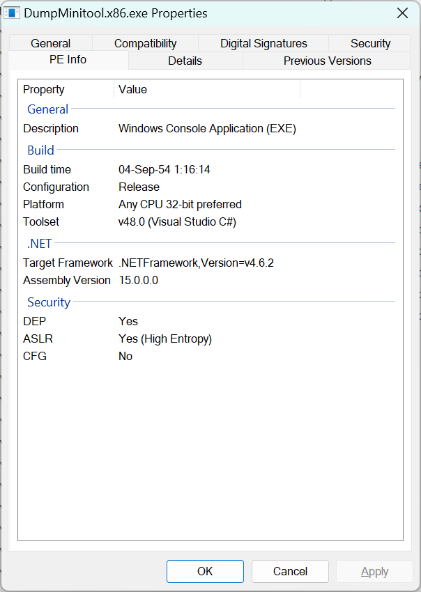
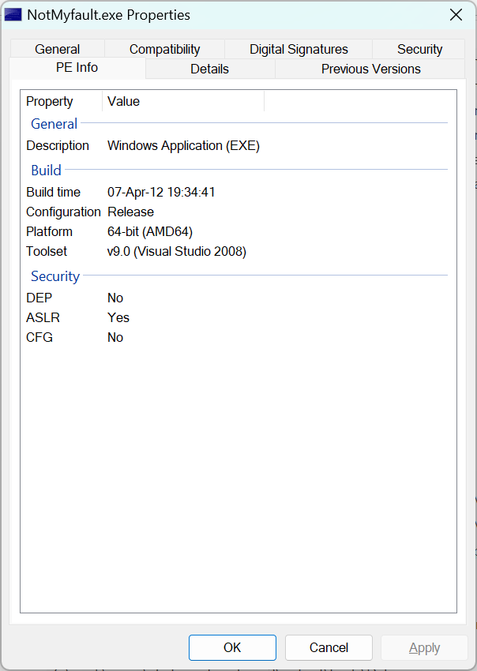

# BinaryInfo - File Properties relevant to software developers

The well-known Properties dialog of Windows Explorer shows file properties like Size, Created/Modified/Accessed timestamps, Read-Only flag, etc.
As a software developer I often more interested in different kind of properties for PE binaries, such as:
* Actual build timestamp (the 'Created timestamp' might differ)
* Build configuration (Release or Debug?)
* Bitness (32-bit? 64-bit? AnyCPU?)
* Version of Visual Studio used to build the image
* Target .NET Framework version (for .NET binaries)
* .NET assembly version (used for resolving dependencies)
* etc

Even though all this information could be extracted with various PE viewers, sometimes it requires digging, decoding and combining various fields of a PE header. 
The idea of this project is to quickly get access to all this information.

